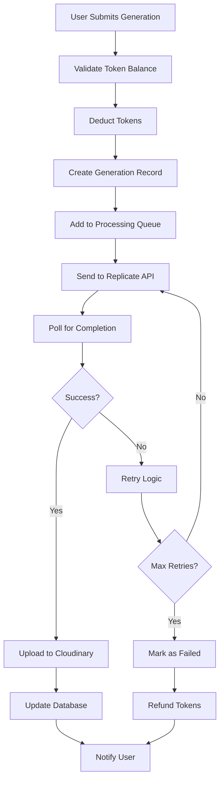

# Week 5: AI Integration & Generation System - Development Plan

## Overview

Week 5 focuses on implementing the core AI generation capabilities of Style Studio AI. This is the most critical phase of the MVP development, as it brings the main value proposition to life - AI-powered clothing visualization using the Replicate API.

## Current Context

**Completed Prerequisites:**

- ✅ Phase 0: Project Foundation (Next.js 15 + TypeScript + shadcn/ui)
- ✅ Week 2: Backend Foundation & Authentication (Convex + NextAuth.js)
- ✅ Week 3: Core UI Components & Layout (Complete app layout system)
- ✅ Week 4: Image Upload & Management System (Cloudinary integration)

**Available Infrastructure:**

- Complete Convex database schema with generations, files, users, tokens, usage tables
- Authentication system with OAuth providers (Google, GitHub)
- File upload and storage system with Cloudinary
- Real-time subscriptions for live updates
- Token balance management system
- Comprehensive UI component library

## Phase Breakdown

---

## Phase 1: Replicate API Integration (Days 1-3)

### 1.1 Replicate Service Setup (Day 1)

**Priority**: Critical
**Estimated Time**: 6-8 hours

#### Infrastructure Setup

1. **Environment Configuration**

   - Add Replicate API key to environment variables
   - Configure API endpoints and model versions
   - Set up rate limiting and quota management

2. **Service Architecture**

   - Create `src/lib/replicate.ts` - Core Replicate client wrapper
   - Create `src/services/generation.ts` - Generation orchestration service
   - Create `src/lib/prompt-engineering.ts` - Prompt optimization utilities

3. **Model Configuration**
   - Configure supported AI models (Stable Diffusion XL, Flux, etc.)
   - Define model parameters and constraints
   - Set up model-specific prompt templates

#### File Structure:

```
src/
├── lib/
│   ├── replicate.ts          # Replicate API client
│   ├── prompt-engineering.ts # Prompt optimization
│   └── generation-queue.ts   # Queue management
├── services/
│   ├── generation.ts         # Generation orchestration
│   └── image-processing.ts   # Image preprocessing
└── types/
    └── generation.ts         # Generation-specific types
```

#### Technical Specifications:

**Replicate Client (`src/lib/replicate.ts`)**

```typescript
interface ReplicateConfig {
  apiToken: string;
  defaultModel: string;
  timeoutMs: number;
  retryAttempts: number;
}

interface GenerationRequest {
  model: string;
  input: {
    image: string;
    prompt: string;
    negative_prompt?: string;
    num_inference_steps?: number;
    guidance_scale?: number;
    width?: number;
    height?: number;
    seed?: number;
  };
}

interface GenerationResponse {
  id: string;
  status: "starting" | "processing" | "succeeded" | "failed" | "canceled";
  output?: string[];
  error?: string;
  metrics?: {
    predict_time?: number;
  };
}
```

**Generation Service (`src/services/generation.ts`)**

```typescript
interface GenerationOptions {
  productImageUrl: string;
  modelImageUrl?: string;
  style: "realistic" | "artistic" | "minimal";
  aspectRatio: "1:1" | "16:9" | "9:16" | "3:2" | "2:3";
  quality: "standard" | "high" | "ultra";
  customPrompt?: string;
}

interface GenerationResult {
  success: boolean;
  replicateId?: string;
  resultImageUrl?: string;
  processingTime?: number;
  error?: string;
}
```

### 1.2 Prompt Engineering System (Day 1-2)

**Priority**: Critical
**Estimated Time**: 8-10 hours

#### Prompt Templates

1. **Base Prompt Structure**

   ```
   "A {product_description} worn by a {model_description} in a {setting},
   {style_modifiers}, professional fashion photography, {quality_modifiers}"
   ```

2. **Style Variations**

   - **Realistic**: "photorealistic, studio lighting, commercial photography"
   - **Artistic**: "artistic style, creative lighting, fashion editorial"
   - **Minimal**: "clean background, minimal styling, product focus"

3. **Quality Modifiers**
   - **Standard**: "good quality, clear details"
   - **High**: "high resolution, sharp details, professional quality"
   - **Ultra**: "ultra high quality, 8k resolution, award-winning photography"

#### Prompt Engineering Features:

1. **Automated Product Analysis**

   - Detect clothing type from product image
   - Extract colors and patterns
   - Identify clothing category (shirt, dress, pants, etc.)

2. **Model Integration**

   - Use uploaded model image for pose reference
   - Extract model characteristics (if provided)
   - Generate appropriate model descriptions

3. **Negative Prompts**
   - Remove unwanted elements
   - Improve image quality
   - Prevent common AI artifacts

#### Implementation Files:

- `src/lib/prompt-engineering.ts` - Core prompt generation
- `src/lib/image-analysis.ts` - Basic image analysis utilities
- `src/constants/prompts.ts` - Prompt templates and variations

### 1.3 Generation Queue System (Day 2-3)

**Priority**: High
**Estimated Time**: 8-10 hours

#### Queue Architecture

1. **Database Integration**

   - Use existing Convex `generations` table
   - Implement status tracking (pending → processing → completed/failed)
   - Add retry logic for failed generations

2. **Real-time Updates**

   - Leverage Convex real-time subscriptions
   - Update frontend with generation progress
   - Notify users of completion/failures

3. **Error Handling**
   - Implement exponential backoff for retries
   - Handle Replicate API rate limits
   - Manage token refunds for failed generations

#### Queue Processing Flow:



---

## Phase 2: Generation Interface Development (Days 3-4)

### 2.1 Generation Form Component (Day 3)

**Priority**: High
**Estimated Time**: 6-8 hours

#### Form Features

1. **Image Upload Integration**

   - Product image upload (required)
   - Model image upload (optional)
   - Image preview with editing options
   - Validation and error handling

2. **Generation Parameters**

   - AI model selection dropdown
   - Style preset selection (realistic, artistic, minimal)
   - Aspect ratio options
   - Quality settings
   - Custom prompt input (optional)

3. **Token Integration**
   - Display current token balance
   - Show token cost for generation
   - Prevent submission with insufficient tokens
   - Link to token purchase flow

#### Component Structure:

```
src/components/generation/
├── GenerationForm.tsx        # Main form component
├── ModelSelector.tsx         # AI model selection
├── StylePresets.tsx          # Style selection
├── ParameterControls.tsx     # Advanced parameters
├── TokenBalance.tsx          # Token balance display
└── GenerationPreview.tsx     # Preview before generation
```

#### Form Validation Schema:

```typescript
const generationFormSchema = z.object({
  productImage: z.string().url("Product image is required"),
  modelImage: z.string().url().optional(),
  model: z.enum(["stable-diffusion-xl", "flux-dev", "stable-diffusion-3"]),
  style: z.enum(["realistic", "artistic", "minimal"]),
  aspectRatio: z.enum(["1:1", "16:9", "9:16", "3:2", "2:3"]),
  quality: z.enum(["standard", "high", "ultra"]),
  customPrompt: z.string().max(500).optional(),
});
```

### 2.2 Real-time Status Interface (Day 3-4)

**Priority**: High
**Estimated Time**: 6-8 hours

#### Status Components

1. **Generation Progress**

   - Real-time status updates using Convex subscriptions
   - Progress indicators for different stages
   - Estimated completion time
   - Cancel generation option

2. **Status States**

   - **Pending**: Queued for processing
   - **Processing**: Being generated by AI
   - **Completed**: Successfully generated
   - **Failed**: Generation failed with error details
   - **Cancelled**: User cancelled generation

3. **Progress Visualization**
   - Animated progress bars
   - Stage-by-stage breakdown
   - Processing time estimates
   - Queue position (if applicable)

#### Real-time Integration:

```typescript
// Using Convex subscriptions for real-time updates
const generation = useQuery(api.realtime.subscribeToGeneration, {
  generationId: currentGenerationId,
});

// Auto-refresh generation list
const userGenerations = useQuery(api.realtime.subscribeToUserGenerations, {
  userId: user.id,
});
```

### 2.3 Result Display & Management (Day 4)

**Priority**: High
**Estimated Time**: 4-6 hours

#### Result Features

1. **Image Display**

   - High-quality image viewer
   - Before/after comparison
   - Zoom and pan functionality
   - Download options

2. **Generation Details**

   - Show generation parameters used
   - Processing time and model info
   - Token cost display
   - Generation timestamp

3. **Action Buttons**
   - Download high-resolution image
   - Share generation (future feature)
   - Delete generation
   - Regenerate with same parameters

#### Component Implementation:

```
src/components/generation/
├── GenerationResult.tsx      # Main result display
├── ImageComparison.tsx       # Before/after viewer
├── GenerationDetails.tsx     # Parameters and metadata
└── ResultActions.tsx         # Download, share, delete actions
```

---

## Phase 3: Generation History & Management (Day 4-5)

### 3.1 Generation History Interface (Day 4)

**Priority**: Medium
**Estimated Time**: 4-6 hours

#### History Features

1. **Generation Grid**

   - Responsive grid layout
   - Thumbnail previews
   - Status indicators
   - Filter and sort options

2. **Filtering & Search**

   - Filter by status (completed, failed, pending)
   - Filter by date range
   - Filter by model used
   - Search by custom prompts

3. **Pagination**
   - Infinite scroll or traditional pagination
   - Load more functionality
   - Performance optimization for large lists

#### Implementation:

```typescript
// History component with filtering
const GenerationHistory = () => {
  const [filters, setFilters] = useState({
    status: "all",
    dateRange: "30days",
    model: "all",
  });

  const generations = useQuery(api.generations.getUserGenerations, {
    userId: user.id,
    limit: 20,
    status: filters.status !== "all" ? filters.status : undefined,
  });
};
```

### 3.2 Batch Operations (Day 5)

**Priority**: Low
**Estimated Time**: 3-4 hours

#### Batch Features

1. **Multi-selection**

   - Select multiple generations
   - Bulk download
   - Bulk delete
   - Bulk retry for failed generations

2. **Export Options**
   - ZIP download of selected images
   - CSV export of generation metadata
   - Shareable gallery links

---

## Phase 4: Error Handling & Optimization (Day 5)

### 4.1 Comprehensive Error Handling (Day 5)

**Priority**: Critical
**Estimated Time**: 4-6 hours

#### Error Categories

1. **API Errors**

   - Replicate API failures
   - Rate limit exceeded
   - Invalid parameters
   - Network timeouts

2. **User Errors**

   - Insufficient tokens
   - Invalid image formats
   - File size limits
   - Parameter validation

3. **System Errors**
   - Database failures
   - Storage issues
   - Processing timeouts

#### Error Recovery

1. **Automatic Retry**

   - Exponential backoff for API failures
   - Maximum retry attempts (3)
   - Token refund for permanent failures

2. **User Notifications**

   - Toast notifications for errors
   - Detailed error messages
   - Suggested actions for resolution

3. **Fallback Mechanisms**
   - Alternative model selection
   - Simplified parameters
   - Queue position preservation

### 4.2 Performance Optimization (Day 5)

**Priority**: Medium
**Estimated Time**: 2-4 hours

#### Optimization Areas

1. **Image Processing**

   - Optimize image uploads before sending to Replicate
   - Implement image compression
   - Cache processed images

2. **API Efficiency**

   - Batch API requests where possible
   - Implement request deduplication
   - Optimize polling intervals

3. **Frontend Performance**
   - Lazy load generation history
   - Optimize real-time subscriptions
   - Implement proper loading states

---

## API Endpoints & Integration

### New API Routes

```
src/app/api/
├── generation/
│   ├── create/route.ts       # Create new generation
│   ├── status/route.ts       # Check generation status
│   ├── cancel/route.ts       # Cancel generation
│   └── retry/route.ts        # Retry failed generation
├── replicate/
│   ├── webhook/route.ts      # Replicate webhooks
│   └── models/route.ts       # Available models
└── images/
    ├── upload/route.ts       # Image upload handler
    └── process/route.ts      # Image preprocessing
```

### Convex Functions Integration

**New Convex Functions:**

```typescript
// convex/generations.ts - Enhanced functions
export const processGenerationQueue = action({
  args: {},
  handler: async (ctx) => {
    // Process pending generations
    // Call Replicate API
    // Update generation status
  },
});

export const updateFromReplicate = mutation({
  args: {
    replicateId: v.string(),
    status: v.string(),
    output: v.optional(v.array(v.string())),
  },
  handler: async (ctx, args) => {
    // Update generation from Replicate webhook
  },
});
```

---

## Testing Strategy

### Unit Tests

1. **Prompt Engineering**

   - Test prompt template generation
   - Validate prompt optimization
   - Test error handling in prompt creation

2. **Generation Service**

   - Mock Replicate API responses
   - Test retry logic
   - Validate error handling

3. **Queue Management**
   - Test queue processing logic
   - Validate status transitions
   - Test concurrency handling

### Integration Tests

1. **End-to-End Generation Flow**

   - Full generation process from form to result
   - Test with various image types and parameters
   - Validate token deduction and refund logic

2. **Real-time Updates**
   - Test Convex subscription updates
   - Validate UI state synchronization
   - Test error propagation

### Manual Testing

1. **User Experience**

   - Test generation form usability
   - Validate error messages and recovery
   - Test on different devices and browsers

2. **Performance Testing**
   - Test with multiple concurrent generations
   - Validate system performance under load
   - Test image upload and processing speed

---

## Security Considerations

### API Security

1. **Authentication**

   - Validate user sessions for all generation requests
   - Implement proper authorization checks
   - Secure API endpoints with rate limiting

2. **Input Validation**

   - Sanitize user prompts
   - Validate image uploads
   - Prevent prompt injection attacks

3. **Resource Protection**
   - Implement generation quotas
   - Prevent abuse through rate limiting
   - Monitor for suspicious activity

### Data Protection

1. **Image Security**

   - Secure image upload handling
   - Implement proper file validation
   - Protect against malicious file uploads

2. **Privacy**
   - Respect user data privacy
   - Implement proper data retention policies
   - Secure transmission of sensitive data

---

## Performance Metrics & Monitoring

### Key Performance Indicators

1. **Generation Metrics**

   - **Generation Success Rate**: Target >95%
   - **Average Processing Time**: Target <60 seconds
   - **Queue Wait Time**: Target <5 seconds
   - **Error Rate**: Target <5%

2. **User Experience Metrics**

   - **Time to First Generation**: Target <2 minutes
   - **Form Completion Rate**: Target >90%
   - **User Satisfaction**: Target >4.5/5 stars

3. **System Performance**
   - **API Response Time**: Target <200ms
   - **Real-time Update Latency**: Target <1 second
   - **Image Upload Speed**: Target <10 seconds for 10MB

### Monitoring Implementation

1. **Application Monitoring**

   - Implement error tracking with detailed logs
   - Monitor API performance and response times
   - Track user behavior and conversion metrics

2. **AI Service Monitoring**
   - Monitor Replicate API usage and quotas
   - Track generation success/failure rates
   - Monitor model performance and reliability

---

## Risk Mitigation

### Technical Risks

1. **Replicate API Reliability**

   - **Risk**: API downtime or failures
   - **Mitigation**: Implement robust retry logic, queue management, and user notifications

2. **High Processing Times**

   - **Risk**: Slow generation times affecting user experience
   - **Mitigation**: Set realistic expectations, provide progress updates, implement caching

3. **Resource Limits**
   - **Risk**: Hitting Replicate API quotas or rate limits
   - **Mitigation**: Implement queue management, user quotas, and upgraded API plans

### Business Risks

1. **Generation Quality**

   - **Risk**: Poor AI generation results
   - **Mitigation**: Implement prompt engineering, quality filters, and user feedback loops

2. **User Adoption**
   - **Risk**: Users not understanding the generation process
   - **Mitigation**: Clear UI/UX, onboarding tutorials, and comprehensive help documentation

---

## Success Criteria

### Functional Requirements

- ✅ Users can successfully create AI generations with product images
- ✅ Real-time status updates work correctly
- ✅ Token system integrates properly with generation flow
- ✅ Error handling provides clear feedback and recovery options
- ✅ Generation history and management features work as expected

### Performance Requirements

- ✅ Generation success rate >95%
- ✅ Average generation time <60 seconds
- ✅ System handles concurrent generations properly
- ✅ Real-time updates have <1 second latency
- ✅ Error recovery works within 30 seconds

### User Experience Requirements

- ✅ Intuitive generation form with clear parameters
- ✅ Responsive design works on all devices
- ✅ Loading states and progress indicators provide clear feedback
- ✅ Error messages are helpful and actionable
- ✅ Generation results are displayed clearly with download options

---

## Deliverables

### Core Components

1. **Replicate Integration Service**

   - Complete API client wrapper
   - Prompt engineering system
   - Queue management system

2. **Generation Interface**

   - Generation form with all parameters
   - Real-time status updates
   - Result display and management

3. **Generation History**
   - Comprehensive history interface
   - Filtering and search capabilities
   - Batch operations support

### Documentation

1. **Technical Documentation**

   - API integration guide
   - Component usage documentation
   - Error handling guide

2. **User Documentation**
   - Generation parameter guide
   - Troubleshooting guide
   - Best practices for optimal results

### Testing Artifacts

1. **Test Suites**

   - Unit tests for core functions
   - Integration tests for full flow
   - Performance test scenarios

2. **Test Documentation**
   - Test plan and scenarios
   - Bug reports and resolutions
   - Performance test results

---

## Dependencies & Prerequisites

### External Services

1. **Replicate API Account**

   - API key and authentication
   - Model access and quotas
   - Webhook configuration

2. **Cloudinary Integration**
   - Storage for generated images
   - Image optimization settings
   - CDN configuration

### Internal Dependencies

1. **Completed Week 4 Deliverables**

   - Image upload system
   - Cloudinary integration
   - File management system

2. **Database Schema**
   - Generations table ready
   - Token system implemented
   - Usage tracking configured

---

## Post-Week 5 Considerations

### Immediate Next Steps (Week 6)

1. **Payment Integration**

   - Stripe integration for token purchases
   - Token balance management
   - Purchase history

2. **Dashboard Enhancement**
   - Generation statistics
   - Usage analytics
   - Account management

### Future Enhancements

1. **Advanced Features**

   - Multiple AI model options
   - Custom style presets
   - Batch generation capabilities

2. **Performance Optimizations**
   - Generation caching
   - Preemptive processing
   - Advanced queue management

---

## Conclusion

Week 5 represents the culmination of the MVP core functionality, bringing together all previous infrastructure work to deliver the primary value proposition of Style Studio AI. The comprehensive AI integration system will provide users with a seamless, professional-grade AI generation experience while maintaining robust error handling, real-time updates, and optimal performance.

The modular architecture ensures that the system can be easily extended in future phases with additional AI models, advanced features, and performance optimizations. The careful attention to error handling, security, and user experience will provide a solid foundation for the production launch and future scaling of the platform.

**Key Success Factors:**

- Robust Replicate API integration with proper error handling
- Intuitive user interface with clear feedback mechanisms
- Real-time status updates providing transparency to users
- Comprehensive testing ensuring reliability and performance
- Security measures protecting user data and preventing abuse
- Performance optimizations ensuring fast and responsive experience

This plan provides a detailed roadmap for implementing the core AI generation capabilities while maintaining the high standards of code quality, user experience, and system reliability established in previous phases.
